# FinTrack — Architecture & Flow (Basics se Samjho)

> Yeh document FinTrack ko ek dum zero se samjhata hai — kaise socha, kaise shuru kiya, kaise ek ek cheez bani.

---

## 🧭 Sabse Pehle — Soch kya thi?

**Goal:** Ek aisa app banao jahan user apni income aur expenses track kar sake, multiple accounts manage kar sake, budget set kar sake, aur jab budget cross ho toh **automatically email aaye**.

Is goal ko 5 layers mein toda gaya:

```
1. USER ko authenticate karo           → Clerk
2. Data store karo                     → MongoDB (Mongoose)
3. Data ke saath kaam karo             → Server Actions
4. Background mein kaam karo           → Inngest
5. Email bhejo                         → Resend + React Email
```

---

## 📐 Step 1 — Project Banaya (Next.js Foundation)

```
npx create-next-app@latest FinTrack
```

**Kya mila:**
```
FinTrackNew/
├── app/              ← Pages aur Layouts (App Router)
├── public/           ← Static files (images, logo)
├── middleware.js     ← Har request se pehle chalta hai
└── next.config.mjs  ← Next.js config
```

**App Router kyun?**
- Server Components → page load pe zero JS bundle
- Server Actions → API routes likhne ki zarurat nahi
- Turbopack → super fast dev server

---

## 🔐 Step 2 — Authentication (Clerk)

Sabse pehla kaam tha **user kaun hai** yeh jaanna.

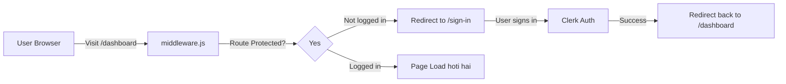

### `middleware.js` — Har Request ka Darwazadar

```js
const isProtectedRoute = createRouteMatcher([
  "/dashboard(.*)",
  "/account(.*)",
  "/transaction(.*)",
]);

export default clerkMiddleware(async (auth, req) => {
  if (isProtectedRoute(req)) {
    await auth.protect();  // ← Nahi logged in? Redirect!
  }
});
```

**Rule:** `/dashboard`, `/account`, `/transaction` — ye teen routes sirf logged-in users ke liye hain. Baaki sab (landing page) public hai.

---

## 🗄️ Step 3 — Database (MongoDB + Mongoose Models)

Data store karne ke liye **4 tables (collections)** banaye:

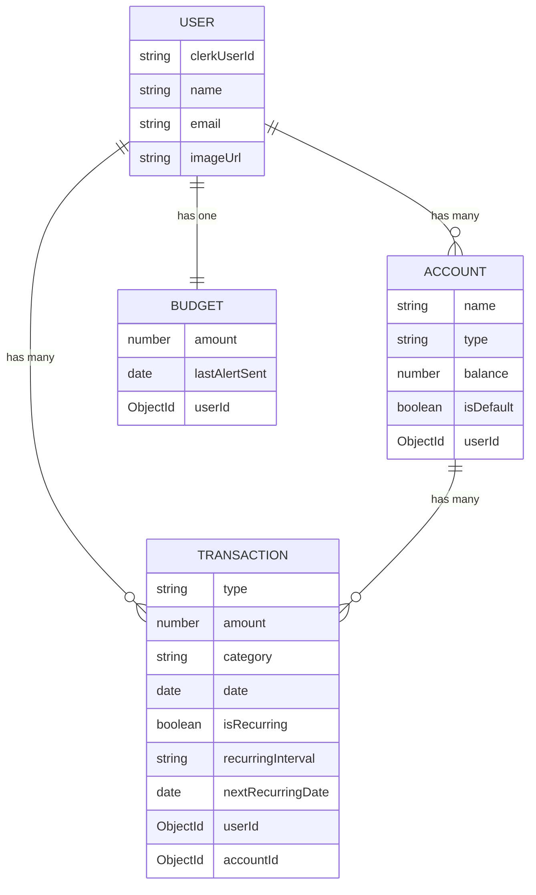

### `lib/mongoose.js` — Database Connection

```
App start hoti hai
    ↓
mongoose.connect() call hota hai
    ↓
Connection "cache" mein save hota hai (global.mongoose)
    ↓
Dobaara connect karne ki zarurat nahi (hot reload pe bhi safe)
```

---

## 👤 Step 4 — User Sync (`lib/checkUser.js`)

**Problem:** Clerk ka user alag hota hai, MongoDB ka alag. Dono ko sync karna tha.

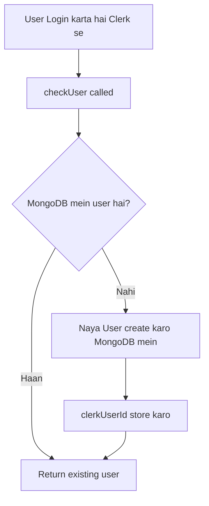

**Yeh isliye important hai** kyunki MongoDB mein `_id` alag hota hai. Jab bhi hum `auth()` se `userId` lete hain (Clerk ka), usse MongoDB ke `user._id` mein convert karna hota hai:

```
Clerk userId (string) → User.findOne({ clerkUserId }) → user._id (ObjectId)
```

---

## ⚡ Step 5 — Server Actions (App ka Dil)

**Server Actions = Functions jo server pe chalte hain, client se call hote hain.**

Koi API route likhne ki zarurat nahi. Form submit karo ya button dabao → directly server function chalta hai.

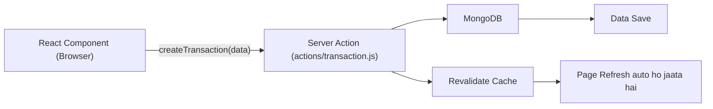

### Kaise ek ek action bana — ek ek flow

---

### 🏦 `actions/dashboard.js`

**3 kaam karta hai:**

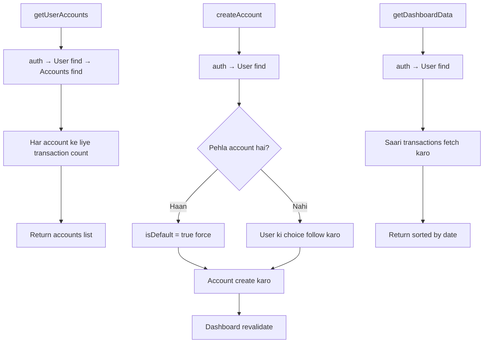

---

### 💳 `actions/account.js`

**3 kaam karta hai:**

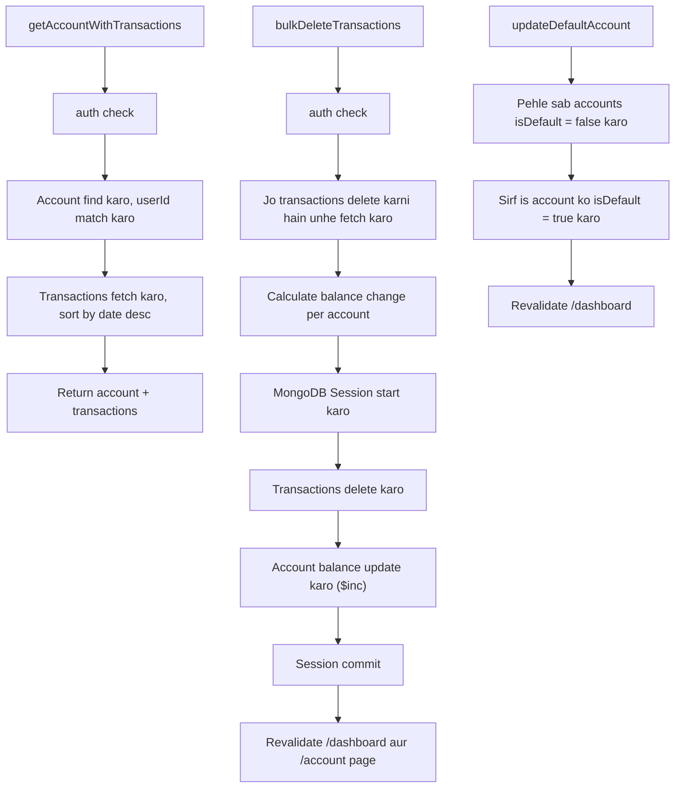

**MongoDB Session kyun?** — Agar delete hoti hai lekin balance update nahi hota toh inconsistent state ho jaata. Session ensure karta hai: **ya sab hoga, ya kuch nahi hoga (ACID).**

---

### 📝 `actions/transaction.js`

Yeh sabse complex action file hai. 4 functions hain:

```mermaid
flowchart TD
    subgraph CREATE["createTransaction(data)"]
        A1[auth + user find] --> A2[Account verify karo ki user ka hi hai]
        A2 --> A3["balanceChange = EXPENSE ? -amount : +amount"]
        A3 --> A4[MongoDB Session]
        A4 --> A5[Transaction create karo]
        A5 --> A6["Account balance update ($inc)"]
        A6 --> A7[Session commit]
        A7 --> A8[Revalidate pages]
        A8 --> A9{EXPENSE hai?}
        A9 -->|Haan| A10[Budget check + real-time alert]
        A9 -->|Nahi| A11[Return success]
        A10 --> A11
    end

    subgraph UPDATE["updateTransaction(id, data)"]
        B1[Original transaction fetch karo] --> B2[Old balance change calculate karo]
        B2 --> B3[New balance change calculate karo]
        B3 --> B4["Net difference = new - old"]
        B4 --> B5[Session mein update + balance adjust]
    end

    subgraph GET["getTransaction(id)"]
        C1[auth + user find] --> C2[findOne with userId match]
        C2 --> C3[Return serialized doc]
    end

    subgraph LIST["getUserTransactions(query)"]
        D1[auth + user find] --> D2[find with query filter]
        D2 --> D3[populate accountId]
        D3 --> D4[sort by date desc]
    end
```

---

### 💰 `actions/budget.js`

**2 kaam:**

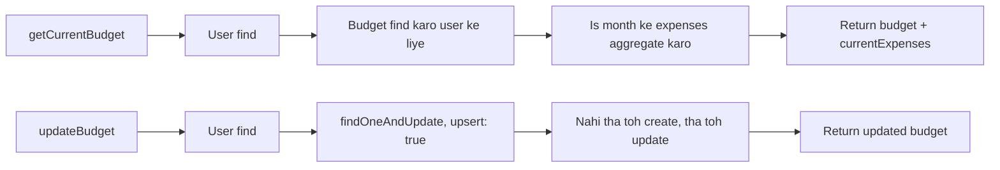

---

### 🚨 `actions/budget-alert.js`

**Jab user dashboard pe budget 80% cross karta hai tab call hota hai:**

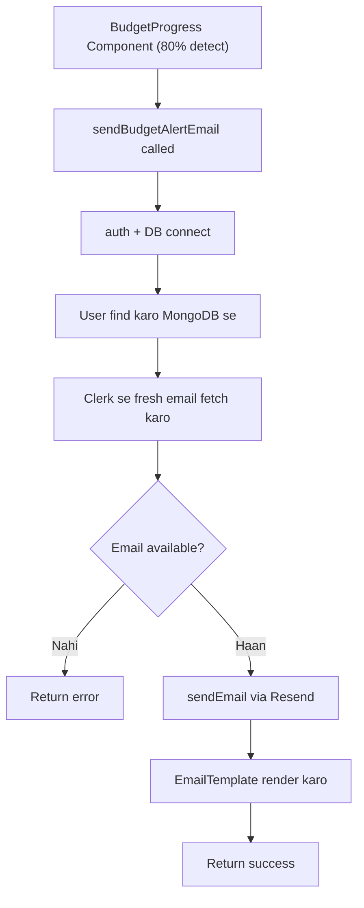

---

### 📧 `actions/send-email.js`

**Sabse simple — sirf Resend ka wrapper:**

```js
Resend.emails.send({
  from: "Finance App <onboarding@resend.dev>",
  to, subject, react  // ← React component as email body
})
```

---

## ⏰ Step 6 — Background Jobs (Inngest)

**Problem:** Kuch kaam user ke request ke bina bhi karna tha:
1. Roz midnight pe recurring transactions process karo
2. Har mahine 1 tarikh ko financial report bhejo
3. Har 6 ghante mein budget check karo

**Solution: Inngest** — Serverless background jobs with retry + throttling.

```mermaid
flowchart TD
    subgraph CRON1["Daily Midnight — Recurring Transactions"]
        R1[triggerRecurringTransactions] --> R2[Saare due recurring transactions fetch karo]
        R2 --> R3["Har ek ke liye event bhejo: transaction.recurring.process"]
        R3 --> R4[processRecurringTransaction event sunata hai]
        R4 --> R5["Throttle: max 10/min per user"]
        R5 --> R6[Naya transaction create karo]
        R6 --> R7[Balance update karo]
        R7 --> R8[nextRecurringDate update karo]
    end

    subgraph CRON2["1st of Month — Monthly Report"]
        M1[generateMonthlyReports] --> M2[Saare users fetch karo]
        M2 --> M3[Pichle mahine ka data nikalo]
        M3 --> M4[Financial insights generate karo]
        M4 --> M5[React Email template render karo]
        M5 --> M6[Resend se email bhejo]
    end

    subgraph CRON3["Every 6 Hours — Budget Check"]
        B1[checkBudgetAlerts] --> B2[Saare budgets fetch karo]
        B2 --> B3[Default account ke expenses aggregate karo]
        B3 --> B4{">= 80% used?"}
        B4 -->|"Haan + naya month"| B5[Alert email bhejo]
        B5 --> B6[lastAlertSent update karo]
        B4 -->|Nahi| B7[Skip]
    end
```

---

## 🖥️ Step 7 — Frontend Flow (User kya dekhta hai)

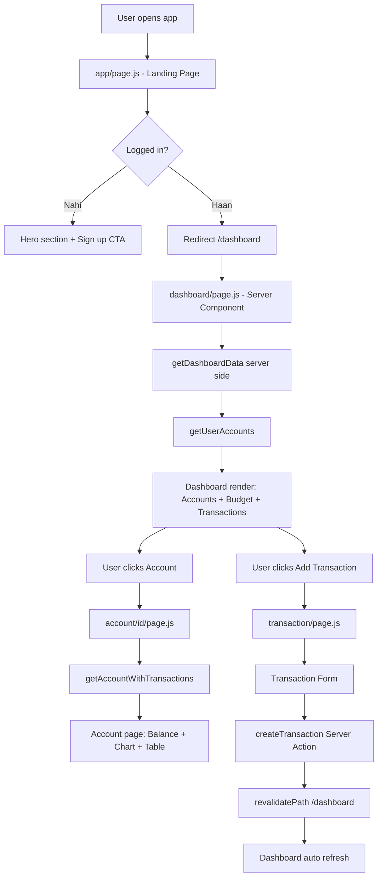

---

## 🔄 Complete Data Flow — Ek Transaction Create karne ka poora safar

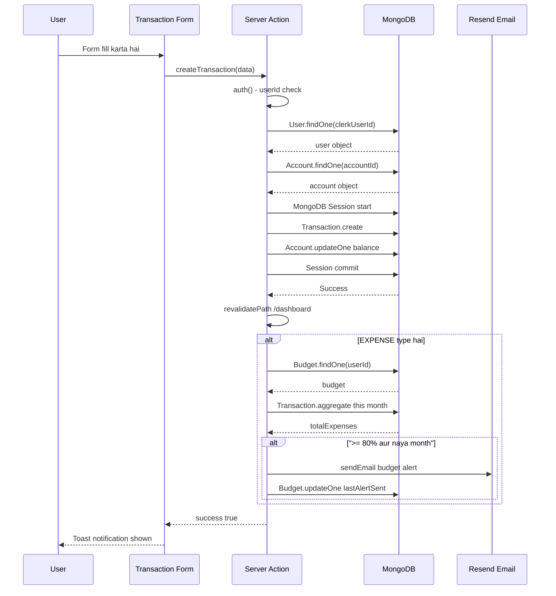

---

## 🗂️ File-by-File Summary (Ek Nazar Mein)

| File | Kya karta hai |
|------|--------------|
| `middleware.js` | Protected routes guard — unauthorized users redirect |
| `lib/mongoose.js` | MongoDB connection cache |
| `lib/checkUser.js` | Clerk user ↔ MongoDB user sync |
| `lib/utils.js` | `cn()` — Tailwind class merger |
| `lib/formatCurrency.js` | `₹1,50,000.00` format karta hai |
| `models/User.js` | User schema |
| `models/Account.js` | Bank account schema |
| `models/Transaction.js` | Transaction schema (recurring support ke saath) |
| `models/Budget.js` | Monthly budget schema |
| `actions/dashboard.js` | Accounts list + create account + dashboard data |
| `actions/account.js` | Account detail + bulk delete + default account set |
| `actions/transaction.js` | Create / read / update / list transactions |
| `actions/budget.js` | Get + update monthly budget |
| `actions/budget-alert.js` | Real-time budget alert email |
| `actions/send-email.js` | Resend wrapper |
| `actions/seed.js` | Dev-only fake data generator |
| `lib/inngest/client.js` | Inngest client init |
| `lib/inngest/function.js` | 4 background jobs (recurring, reports, budget check) |
| `emails/template.jsx` | React Email templates |
| `data/landing.js` | Landing page ka static content |
| `data/categories.js` | Transaction categories list |

---

## 🧱 Architecture Summary (Ek Line Mein)

```
Browser → Middleware (Clerk guard) → Next.js Pages (Server Components)
    → Server Actions (DB mutations) → MongoDB (Mongoose)
    → Inngest (Background jobs) → Resend (Emails)
```

> **Koi dedicated backend server nahi hai.** Sab kuch Next.js ke andar hi hai —
> Server Actions ne API routes ki zarurat khatam kar di, aur Inngest ne background server ki.

---

## 🔗 Frontend ↔ Backend Connection — Interview Wala Flow

> **Sabse important concept:** Is project mein koi alag backend server nahi hai.
> Next.js ne frontend aur backend dono ko ek hi jagah combine kar diya hai.
> Lekin concept wahi hai — data jaata hai, process hota hai, wapas aata hai.

---

### 🧠 Pehle Concept Samjho — Traditional vs Next.js

#### Traditional App (React + Express) mein:
```
Browser (React) → HTTP Request (fetch/axios) → Express Server → Database
                ← JSON Response             ←               ←
```

#### Tumhara FinTrack (Next.js App Router) mein:
```
Browser (React Component) → Server Action call (direct function) → MongoDB
                          ← Return value / revalidatePath        ←
```

**Farak kya hai?**
- Traditional: `fetch('http://localhost:5000/api/accounts')` — network call likhni padti hai
- FinTrack: `getUserAccounts()` — directly function call, but server pe run hota hai
- HTTP request abhi bhi andar se hoti hai, par tumhe likhni nahi padti!

---

### 🔄 Step-by-Step: User Dashboard Open Karta Hai

```
1. User browser mein /dashboard type karta hai
        ↓
2. middleware.js har request ko intercept karta hai
   (clerkMiddleware — Clerk ki library)
        ↓
3. middleware check karta hai: /dashboard protected route hai?
   → Haan! → auth.protect() call hota hai
        ↓
4. Clerk check karta hai: browser mein valid session cookie hai?
   → Nahi → /sign-in pe redirect
   → Haan → aage jaane do
        ↓
5. Next.js app/(main)/dashboard/page.jsx execute hota hai
   (YEH SERVER PE HOTA HAI — browser mein nahi!)
        ↓
6. page.jsx ke andar SERVER ACTIONS call hote hain:
   const [accounts, transactions] = await Promise.all([
     getUserAccounts(),    ← actions/dashboard.js
     getDashboardData(),   ← actions/dashboard.js
   ]);
        ↓
7. getUserAccounts() andar:
   a. auth() → Clerk se userId milti hai
   b. connectToDatabase() → MongoDB se connection
   c. User.findOne({ clerkUserId: userId }) → MongoDB query
   d. Account.find({ userId: user._id }) → accounts fetch
   e. data return hoti hai
        ↓
8. page.jsx ko data mil jaata hai
   → HTML render hoti hai (server pe!)
   → Yeh HTML browser ko bheja jaata hai
        ↓
9. Browser HTML display karta hai — DONE!
```

---

### 🔄 Step-by-Step: User Naya Account Banata Hai (Frontend → Backend)

```
1. User "Add Account" button dabata hai
        ↓
2. CreateAccountDrawer component open hota hai (Client Component)
   → Yeh component browser mein run hota hai
        ↓
3. User form fill karta hai (name, balance, type)
        ↓
4. User "Create" button dabata hai
        ↓
5. React form ka onSubmit trigger hota hai
   → createAccount(formData) call hota hai
        ↓
6. ⭐ YEH KEY MOMENT HAI ⭐
   createAccount() ek Server Action hai ("use server" likha hai upar)
   → Next.js automatically ek HTTP POST request banata hai
   → Yeh request Next.js ke internal server pe jaati hai
   → createAccount function SERVER pe execute hota hai
        ↓
7. Server pe createAccount():
   a. auth() → userId verify karo
   b. connectToDatabase() → MongoDB connect
   c. Account.create({...data}) → database mein save
   d. revalidatePath('/dashboard') → cache invalidate karo
   e. return { success: true, data: account }
        ↓
8. Response browser ko wapas milta hai
        ↓
9. revalidatePath ke wajah se:
   → Next.js /dashboard page dobara server pe render karta hai
   → Naya data ke saath HTML browser ko milta hai
   → UI automatically update ho jaata hai
        ↓
10. User ko naya account dikhai deta hai — WITHOUT manual page refresh!
```

---

### 🔄 Step-by-Step: Transaction Delete Karna (Complex Flow)

```
1. User transactions select karta hai (checkboxes)
        ↓
2. "Delete" button dabata hai (Client Component mein)
        ↓
3. bulkDeleteTransactions(transactionIds) call hota hai
   (Server Action — actions/account.js)
        ↓
4. Server pe:
   a. auth() → verify user
   b. MongoDB Session START (important!)
   c. Transactions fetch karo → balance change calculate karo
   d. Transactions.deleteMany({_id: {$in: ids}})
   e. Account.updateOne({ $inc: { balance: -totalAmount } })
   f. Session COMMIT (ya ABORT agar error aaya)
   g. revalidatePath('/dashboard')
   h. revalidatePath('/account/[id]')
        ↓
5. Browser pe UI update ho jaata hai
```

**Session kyun?** → Agar step d complete ho lekin step e fail ho jaaye,
toh transactions delete honge lekin balance update nahi hoga → INCONSISTENT STATE!
Session ensure karta hai: YA DONO HONGE, YA KUCH NAHI HOGA (ACID).

---

### 🏗️ Server Component vs Client Component — Kya Farak Hai?

| | Server Component | Client Component |
|---|---|---|
| **Kahan run hota hai** | Server pe (Node.js) | Browser pe |
| **Kaise pehchano** | Default (koi mark nahi) | File ke top pe `"use client"` |
| **Database access** | ✅ Kar sakta hai | ❌ Nahi kar sakta |
| **useState/useEffect** | ❌ Nahi use kar sakta | ✅ Kar sakta hai |
| **JavaScript browser ko bheja jaata hai?** | ❌ Nahi (zero JS bundle) | ✅ Haan |
| **Example (tumhara project)** | `dashboard/page.jsx` | `BudgetProgress`, `AccountCard` |

```
dashboard/page.jsx (SERVER COMPONENT)
    ↓ data fetch karta hai (MongoDB se directly)
    ↓ data props mein pass karta hai
    ↓
  AccountCard (CLIENT COMPONENT)
      → useState for UI interactions
      → onClick handlers
      → animations
```

---

### ⚡ Server Actions — Andar se Kaise Kaam Karta Hai?

```js
// actions/dashboard.js
"use server";  // ← YEH LINE MAGIC HAI

export async function createAccount(data) {
  // Yeh function SERVER pe run hota hai
  const { userId } = await auth();
  // ...MongoDB operations...
}
```

```jsx
// Client Component mein
import { createAccount } from "@/actions/dashboard";

function MyComponent() {
  const handleSubmit = async (data) => {
    // Yeh BROWSER pe hai, but createAccount SERVER pe run hoga
    const result = await createAccount(data);
    // Next.js ne automatically HTTP POST bana diya andar se!
  };
}
```

**Andar kya hota hai (Next.js khud karta hai):**
```
Browser mein createAccount(data) call hota hai
    → Next.js ek POST request banata hai: POST /_next/action/[hash]
    → Body mein: serialized arguments
    → Server receive karta hai
    → createAccount function execute hota hai
    → Response serialize karke browser ko bhejta hai
    → Browser mein result wapas milta hai
```

---

### 🔁 revalidatePath — UI Auto-Update Kaise Hota Hai?

```
MongoDB mein data change hota hai (create/update/delete)
    ↓
revalidatePath('/dashboard') call hota hai
    ↓
Next.js cache mein /dashboard ki cached copy "stale" mark ho jaati hai
    ↓
Next.js AUTOMATICALLY /dashboard ko dobara server pe render karta hai
    ↓
Fresh HTML browser ko milta hai
    ↓
UI update ho jaata hai — BINA PAGE REFRESH KE!
```

---

### 📊 Poora System — Ek Badi Picture

```
┌─────────────────────────────────────────────────────────────────┐
│                         BROWSER (Client Side)                    │
│                                                                   │
│  ┌──────────────┐    ┌──────────────┐    ┌──────────────────┐   │
│  │  Landing     │    │  Dashboard   │    │  AccountCard     │   │
│  │  page.js     │    │  page.jsx    │    │  (Client Comp)   │   │
│  │  (Server)    │    │  (Server)    │    │  useState, etc   │   │
│  └──────────────┘    └──────────────┘    └──────────────────┘   │
└───────────────────────────┬─────────────────────────────────────┘
                            │ HTTP Request (har page visit pe)
                            ▼
┌─────────────────────────────────────────────────────────────────┐
│                      NEXT.JS SERVER                              │
│                                                                   │
│  middleware.js → Clerk auth check → Route allow/block           │
│                                                                   │
│  ┌──────────────────────────────────────────────────────────┐   │
│  │                    SERVER ACTIONS                         │   │
│  │  actions/dashboard.js  |  actions/transaction.js         │   │
│  │  actions/account.js    |  actions/budget.js              │   │
│  └──────────────────────────────────────────────────────────┘   │
│                            │                                      │
│  ┌─────────────────────────▼──────────────────────────────┐     │
│  │              lib/ (Utilities)                           │     │
│  │  mongoose.js (DB connect) | checkUser.js (user sync)   │     │
│  └─────────────────────────┬──────────────────────────────┘     │
└────────────────────────────┼────────────────────────────────────┘
                             │ Mongoose queries
                             ▼
┌─────────────────────────────────────────────────────────────────┐
│                       MONGODB (Database)                         │
│                                                                   │
│   users  |  accounts  |  transactions  |  budgets               │
└─────────────────────────────────────────────────────────────────┘
                             │
                             │ (Separate — Background jobs)
                             ▼
┌─────────────────────────────────────────────────────────────────┐
│                    INNGEST (Background Jobs)                      │
│                                                                   │
│  Recurring Transactions  |  Monthly Reports  |  Budget Alerts   │
│                                │                                  │
│                         Resend (Emails)                          │
└─────────────────────────────────────────────────────────────────┘
```

---

### 🎯 Interview Mein Poochha Jaaye Toh — Ready Answers

**Q: "Tumne API routes use kiye hain?"**
> Nahi, maine Server Actions use kiye hain. Next.js 14 ke App Router mein
> Server Actions allow karte hain ki main directly server-side functions
> client se call kar sakta hoon bina API routes likhe. Next.js internally
> HTTP POST handle kar leta hai.

**Q: "Authentication kaise implement ki?"**
> Clerk use ki hai. middleware.js mein `clerkMiddleware` se protected routes
> define kiye. Jo bhi `/dashboard`, `/account`, ya `/transaction` visit kare,
> use logged in hona zaroori hai. Clerk ka `auth()` function Server Actions
> mein use karta hoon userId fetch karne ke liye.

**Q: "Frontend se database kaise connect hai?"**
> Frontend directly database se connect nahi hota. Server Components aur
> Server Actions server pe run hote hain, wahan Mongoose se MongoDB connect
> hota hai. Frontend sirf rendered HTML aur interactive Client Components
> receive karta hai.

**Q: "Data consistency kaise ensure ki?"**
> Jab bhi multiple database operations ek saath karni padti hain (jaise
> transaction delete + balance update), main MongoDB Sessions use karta hoon.
> Yeh ACID guarantee deta hai — ya sab operations honge, ya koi nahi.
> `bulkDeleteTransactions` aur `createTransaction` mein yeh pattern use kiya hai.

**Q: "Real-time updates kaise hote hain?"**
> Next.js ka `revalidatePath()` use karta hoon. Jab bhi data change hota hai,
> mein relevant path revalidate karta hoon. Next.js woh page dobara server pe
> render karta hai aur browser ko fresh data milta hai — bina manual page
> refresh ke.

**Q: "Background jobs kaise implement kiye?"**
> Inngest use kiya hai. Teen cron jobs hain:
> 1. Daily midnight: Recurring transactions process karo
> 2. Monthly 1st: Financial report email bhejo (income/expense summary ke saath)
> 3. Har 6 ghante: Budget alerts check karo
> Inngest serverless hai — alag background server rakhne ki zarurat nahi.
